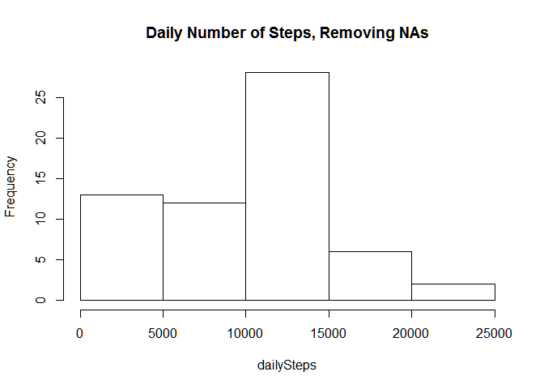
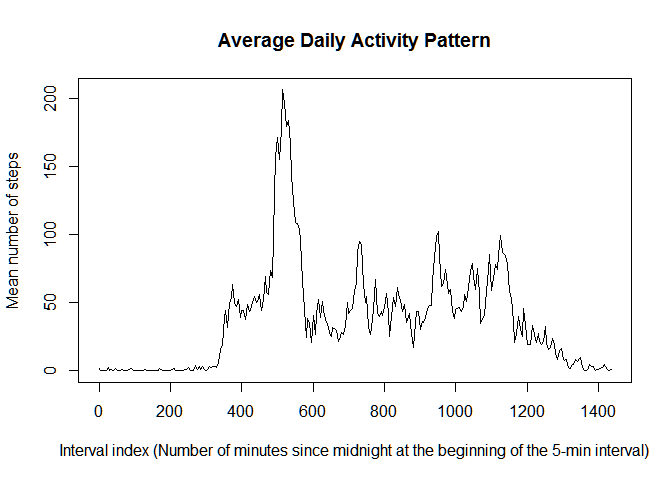
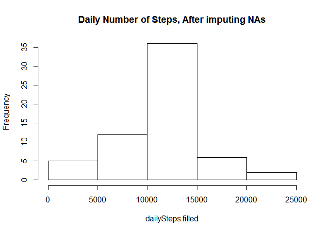
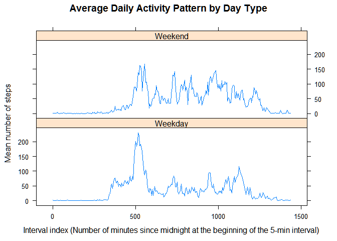

# Reproducible Research: Peer Assessment 1


## Loading and preprocessing the data


```r
## Assume the data file is in current directory.
## Read the data file into the data frame 'dat'.
## See README.MD for code book.

dat <- read.csv("activity.csv", 
                colClasses = c("integer", "Date", "integer"))

library(dplyr)      # For managing data frames.
library(lattice)    # For graphics
```

## What is mean total number of steps taken per day?


```r
## Create an integer vector 'dailyStep'.
## Each element in 'dailyStep' represents the total number of
## steps taken in a particular day.
## 
dat.date <- split(dat, dat$date)
dailySteps <- lapply(dat.date, 
                     function(x) {
                        sum(x$steps, na.rm = TRUE)
                     }
              )   
dailySteps <- as.integer(dailySteps)

## Historgram
hist(dailySteps, main = "Daily Number of Steps, Removing NAs")
```

 

The mean number of steps per day is 9354.2.
The median number of steps per day is 10395.0.


## What is the average daily activity pattern?


```r
## Create the data frame 'intervals' with these variables:
## * meanSteps: the mean steps in the same time interval over all days.
## * min: number of minutes since midnight at the start of the 
##        5-min interval
## Each observation in 'intervals' represents a 5-min interval.
## 
intervals <- group_by(dat, interval)
intervals <- summarize(intervals, meanSteps = mean(steps, na.rm = TRUE))
intervals <- mutate(intervals, min = interval %/% 100 * 60 +
                                     interval %% 100)

plot(intervals$min, intervals$meanSteps, type = "l",
     main = "Average Daily Activity Pattern",
     xlab = "Interval index (Number of minutes since midnight at the beginning of the 5-min interval)",
     ylab = "Mean number of steps")
```

 

```r
maxIndex = which.max(intervals$meanSteps)
```

The 5-min interval starting at 515 minutes after midnight
has a mean of 206.1698113 steps, the maximum among all intervals.

## Imputing missing values


```r
t = table(is.na(dat$steps)) ## Table counting the number of NAs (TRUE) and values (FALSE)

## Add a variable 'steps.filled' to 'dat'. 'steps.filled' is the same as 'steps' when that 
## value is not NA. If that value is NA, then it is filled with the mean number of steps 
## for the interval over all days.
##
## Precondition: The data for the each day starts at midnight.
##               No intermediate intervals missing.
##               Intervals are already sorted chronologically.
##
n = length(dat$steps) 
dat <- cbind(dat,
             data.frame(steps.filled = rep(intervals$meanSteps, length.out = n)))
for (i in 1:n){
    ## Copy from 'steps' to 'steps.filled' if 'steps' is not NA.
    if(!is.na(dat$steps[i])) dat$steps.filled[i] = dat$steps[i]
}
```

The dataset contains 2304 rows with NAs.


```r
## Create an integer vector 'dailyStep.filled'.
## Each element in 'dailyStep.filled' represents the total number of
## steps taken in a particular day, after imputing missing values as above. 
## 
dat.date <- split(dat, dat$date)
dailySteps.filled <- lapply(dat.date, 
                            function(x) {
                                sum(x$steps.filled, na.rm = TRUE)
                            }
                     )   
dailySteps.filled <- as.integer(dailySteps.filled)

## Historgram
hist(dailySteps.filled, main = "Daily Number of Steps, After imputing NAs")
```

 

After filling in missing data:  
- The mean number of steps per day is 
10766.2 vs 
9354.2 before.  
- The median number of steps per day is 
10766.0 vs 
10395.0 before.  
- Imputing missing data increases the mean and the median.
The distance between the mean and the median have closed up significantly 
after imputing missing data.

## Are there differences in activity patterns between weekdays and weekends?


```r
## Create the data frame 'intervals' with these variables:
## * meanSteps: the mean steps in the same time interval over all days.
## * min: number of minutes since midnight at the start of the 
##        5-min interval
## * dayType: Factor with 2 levels 'Weekday', 'Weekend'
## Each observation in 'intervals' represents a 5-min interval.
## 

## Add dayType to the data frame 'dat' 
dayType = rep("Weekday", length.out = n)
for (i in 1:n) {
    day = weekdays(dat$date[i])
    if ((day == "Sunday") | (day == "Saturday")) 
        dayType[i] <- "Weekend"
}
dat <- cbind(dat,
             data.frame(dayType = factor(dayType)))

## Splitting 'dat' into weekday vs weekend
dat.dayType <- split(dat,dat$dayType)

## create sub data frame for weekend
intervals.we <- group_by(dat.dayType$Weekend, interval)
intervals.we <- summarize(intervals.we, meanSteps = mean(steps.filled, na.rm = TRUE))
intervals.we <- mutate(intervals.we, min = interval %/% 100 * 60 +
                                           interval %% 100)
intervals.we <- mutate(intervals.we, dayType = factor("Weekend"))

## create sub data frame for weekday
intervals.wd <- group_by(dat.dayType$Weekday, interval)
intervals.wd <- summarize(intervals.wd, meanSteps = mean(steps.filled, na.rm = TRUE))
intervals.wd <- mutate(intervals.wd, min = interval %/% 100 * 60 +
                                           interval %% 100)
intervals.wd <- mutate(intervals.wd, dayType = factor("Weekday"))

## Merge both Weekend and Weekday data into the data frame 'intervals'.
intervals <- rbind(intervals.wd, intervals.we)
```


```r
## Plotting time series
xyplot(meanSteps ~ min | dayType,
       data = intervals,
       type = "l",
       layout = c(1,2),
       main = "Average Daily Activity Pattern by Day Type",
       xlab = "Interval index (Number of minutes since midnight at the beginning of the 5-min interval)",
       ylab = "Mean number of steps")
```

 
